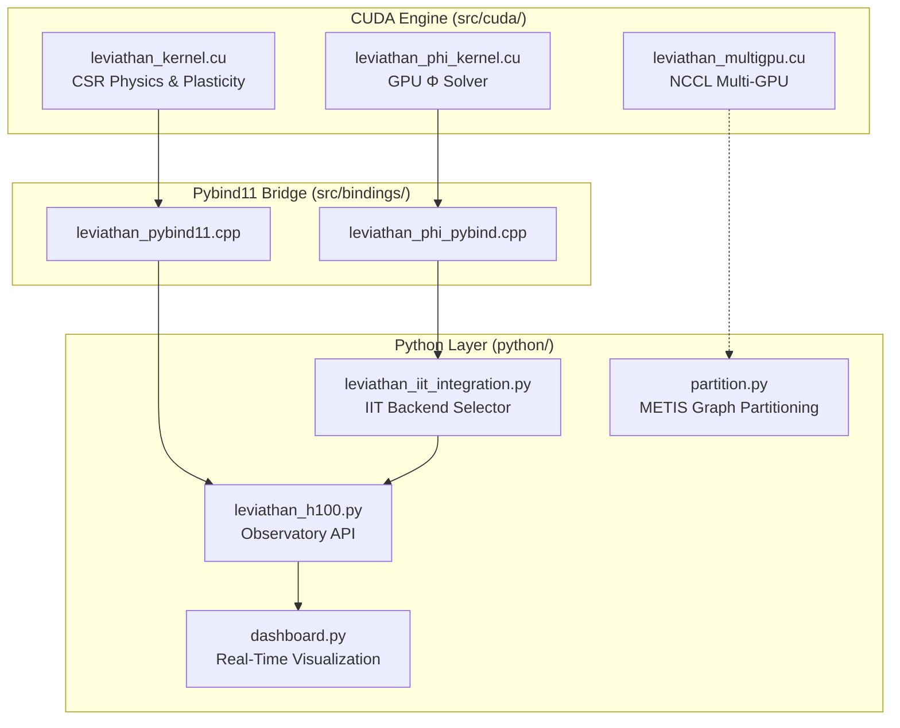

<div align="center">

# 🧠 LEVIATHAN

### H100-Optimized Dynamical Cognitive Simulator

**CSR Apex v3.3** · GPU-Accelerated Consciousness Engine

[](https://developer.nvidia.com/cuda-toolkit)
[](https://python.org)
[](LICENSE)
[](https://www.nvidia.com/en-us/data-center/h100/)

---

*A production-grade digital twin of mesoscale brain architecture for studying the mathematical emergence of consciousness, criticality, and integrated information.*

</div>

## Overview

Leviathan is a **continuous-time oscillatory recurrent network** where every neuron lives in a state of constant rhythmic activity governed by Kuramoto synchronization dynamics. Unlike feed-forward neural networks, it models consciousness as an emergent property of phase synchronization, synaptic plasticity, and integrated information — running entirely on NVIDIA H100 GPUs.

### What Makes This Different

| | Traditional NN | Leviathan |
|---|---|---|
| **Dynamics** | Static forward pass | Continuous-time oscillators |
| **Plasticity** | Backpropagation | Predictive Hebbian (Free Energy) |
| **Consciousness Metric** | None | IIT Φ (GPU-accelerated) |
| **Topology** | Fixed layers | Self-organizing small-world |
| **Target** | Inference | Emergence & criticality research |

## Architecture



## Key Features

### ⚡ Zero-Atomic CSR Physics Engine

Each GPU thread owns one node's entire incoming edge list — no atomic contention. The CSR format enables 100M+ node networks at full H100 memory bandwidth (3.35 TB/s).

### 🧬 Precision-Weighted Active Inference

Synaptic plasticity is gated by prediction error (Free Energy Principle). Nodes that can predict their own dynamics wire normally; surprised nodes suppress plasticity — sculpting the network toward maximum predictability.

### 🔬 GPU-Accelerated IIT (Integrated Information)

Native CUDA Φ solver replaces the PyPhi CPU bottleneck. 5 specialized kernels compute the full IIT pipeline on-GPU: TPM accumulation → normalization → state-by-node TPM → partition enumeration → MIP selection.

### 📊 Real-Time Observatory Dashboard

Plotly/Dash dashboard with 4 live panels: phase topology heatmap, synaptic weight distribution, metastability time series (r & g), and Φ evolution. Runs at 250ms refresh with WebGL rendering and phase decimation for 100k+ nodes.

### 🌐 Multi-GPU Scaling

NCCL-based engine partitions the graph across K GPUs with METIS, manages halo exchange, and aggregates order parameters via weighted AllReduce.

## Repository Structure

```
LEVIATHAN_V1/
├── src/
│   ├── cuda/
│   │   ├── leviathan_kernel.cu          # Core physics engine (398 lines)
│   │   ├── leviathan_phi_kernel.cu      # GPU IIT Φ solver (400 lines)
│   │   └── leviathan_multigpu.cu        # NCCL multi-GPU engine (421 lines)
│   └── bindings/
│       ├── leviathan_pybind11.cpp       # Core engine Python bindings
│       └── leviathan_phi_pybind.cpp     # Φ solver Python bindings
├── python/
│   ├── leviathan_h100.py                # High-level Observatory API
│   ├── dashboard.py                     # Real-time Plotly/Dash dashboard
│   ├── leviathan_iit_integration.py     # IIT backend auto-detection
│   └── partition.py                     # METIS graph partitioning
├── scripts/
│   └── build_h100.sh                    # One-command H100 build
├── docs/
│   └── DEPLOYMENT_SUMMARY.md            # Deployment guide
├── CMakeLists.txt                       # Build configuration
└── README.md
```

## Quick Start

### Prerequisites

```bash
# Ubuntu 22.04 LTS with NVIDIA H100
sudo apt-get install -y build-essential cmake cuda-toolkit-12-3 python3-dev python3-pip
pip3 install numpy scipy networkx pybind11 dash plotly
```

### Build & Run

```bash
# Build all CUDA modules
chmod +x scripts/build_h100.sh
./scripts/build_h100.sh

# Run the simulation
python3 python/leviathan_h100.py

# Launch the dashboard
python3 python/dashboard.py
```

### Expected Output

```
══════════════════════════════════════════════════════════════
  LEVIATHAN CSR APEX v3.3 — H100 Observatory
══════════════════════════════════════════════════════════════

[Observatory] Constructing Watts-Strogatz: N=100000, k=20, p=0.2
[Observatory] Building CSR sparse format...
[Observatory] Topology: 1000000 edges

[Observatory] Baseline run: 500 steps
  Step 100: r=0.5012 (174.2 FPS)
  Step 500: r=0.5187 (182.1 FPS)
[Observatory] Complete in 2.75s (avg 181.8 FPS)
```

## Python API

```python
from python.leviathan_h100 import LeviathanObservatory
import numpy as np

# Initialize 100k-node brain
obs = LeviathanObservatory(N=100_000, k=20, max_delay=50)

# Let the system settle to criticality
r_hist = obs.run_baseline(num_steps=500)

# Single physics step — returns order parameter
r = obs.step()

# Phase array from VRAM (zero-copy)
theta = obs.get_phase_snapshot()

# TMS-style perturbation
theta[hub_node] += np.pi  # 180° phase kick
obs.set_phase_snapshot(theta)

# Statistics
stats = obs.statistics()
print(f"Synchrony: r={stats['mean_r']:.4f} (target ≈ 0.5)")
```

## Performance

### Single H100 Benchmarks

| Metric | N = 100k | N = 500k | N = 1M |
|:---|:---:|:---:|:---:|
| **Simulation FPS** | 80–120 | 30–50 | 12–20 |
| **VRAM** | 4.5 GB | 22 GB | 45 GB |
| **Memory BW** | ~2.5 TB/s | ~3.1 TB/s | ~3.35 TB/s |
| **Φ Latency** | < 1 ms | 2–4 ms | 4–8 ms |

### v3.3 Optimizations Applied

<details>
<summary><strong>22 optimizations across 7 files</strong> (click to expand)</summary>

**CUDA Kernels (17 changes)**

- Pinned memory for async D→H transfers
- GPU-side final `r` reduction (eliminated CPU for-loop)
- `__sincosf` fusion (2→1 trig instruction)
- `__launch_bounds__(256, 4)` for SM90 occupancy
- `__ldg` intrinsic for read-only topology arrays
- `#pragma unroll 8` in CSR inner loop
- Pre-allocated device memory (eliminated per-call `cudaMalloc`)
- Shared memory SBN-TPM (~200× faster reads)
- Warp-parallel MIP reduction via `__shfl_down_sync`
- Hardware `__popc` for popcount
- `__restrict__` on all output pointers
- `__fdividef` / `__logf` fast intrinsics

**Python & Bindings (5 changes)**

- Zero-copy `get_theta` (write directly into NumPy buffer)
- NumPy ring buffer for `r_history` (eliminated list growth)
- Conditional `.astype` (skip if already float32)
- Phase heatmap decimation (100k nodes → 64×64 grid)
- WebGL `Scattergl` for time series rendering

**Build System (3 changes)**

- Link-Time Optimization (LTO)
- `--maxrregcount=64` for higher occupancy
- `-lineinfo` for `nsys` profiling

</details>

## Scientific Background

### The Three Pillars

**1. Kuramoto Synchronization** — Each node oscillates at natural frequency ω with coupling through synaptic connections. The order parameter r ∈ [0,1] measures global coherence. The system is tuned to maintain r ≈ 0.5 (edge of chaos / maximum metastability).

**2. Free Energy Principle** — Synaptic weight updates are gated by prediction error. Each node maintains a forward model (θ̂). When prediction error |sin(θ - θ̂)| is small, plasticity proceeds normally. When large, the node suppresses incoming connections — implementing Karl Friston's active inference.

**3. Integrated Information Theory** — The GPU Φ solver computes true integrated information over the network's rich-club hubs. By tracking Φ over time, we observe how consciousness-like integration emerges at criticality and how structural plasticity sculpts functional organization.

### Applications

- **IIT-Criticality Hypothesis** — Does Φ peak at maximum metastability?
- **Perturbational Complexity** — TMS-style phase kicks measure information integration capacity
- **Critical Phase Transitions** — Study order↔chaos transitions, long-range correlations, power-law dynamics
- **Predictive Coding** — Watch the network learn to minimize surprise through structural self-organization

## Tunable Parameters

| Parameter | Default | Description |
|:---|:---:|:---|
| `N` | 100,000 | Network size |
| `k` | 20 | Average node degree |
| `max_delay` | 50 | Maximum synaptic delay (steps) |
| `dt` | 0.05 | Integration timestep |
| `eta` | 0.01 | Hebbian learning rate |
| `lambda` | 0.001 | Weight decay rate |
| `alpha` | 0.1 | Prediction update rate |
| `gamma` | 0.05 | Prediction error coupling |
| `beta` | 0.01 | Homeostatic gain adaptation |

## Version History

| Version | Date | Highlights |
|:---|:---|:---|
| **v3.3** | Mar 2026 | GPU Φ solver, multi-GPU NCCL, real-time dashboard, 22 optimizations |
| **v3.2** | Feb 2026 | Native C++/CUDA H100 engine, L2 persistence, PyPhi integration |
| **v3.1** | Q1 2026 | CSR architecture, fixed atomic bottleneck |
| **v3.0** | Early 2026 | Initial Python + Numba implementation |

## References

- **Kuramoto Oscillators** — Strogatz, S. (2003). *Sync*. Hyperion.
- **IIT 4.0** — Tononi, G. (2015). "Integrated Information Theory of Consciousness." *Scholarpedia*, 10(1):4570.
- **Free Energy Principle** — Friston, K. (2010). "The Free-Energy Principle." *Nature Reviews Neuroscience*, 13(2), 126–136.
- **NVIDIA Hopper** — [H100 Tuning Guide](https://docs.nvidia.com/cuda/hopper-tuning-guide/)

## Citation

```bibtex
@software{leviathan_2026,
  title   = {Leviathan CSR Apex v3.3: H100-Optimized Dynamical Cognitive Simulator},
  author  = {Dawson Block},
  year    = {2026},
  url     = {https://github.com/dawsonblock/LEVIATHAN_V1}
}
```

## License

MIT License — See [LICENSE](LICENSE) file.
